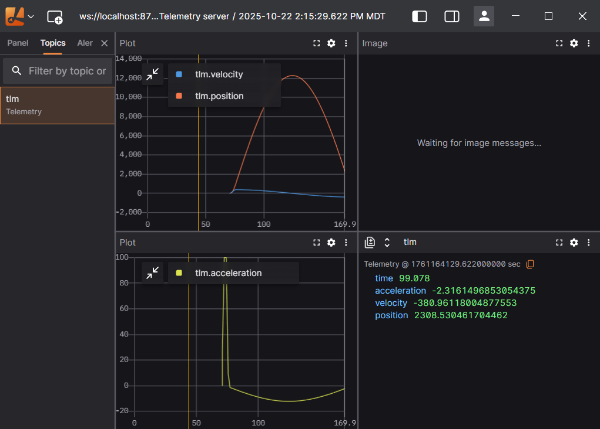

# foxglove_json_server

A lightweight UDP-to-Foxglove bridge that live-streams JSON telemetry and records it to MCAP  


## Features

* Listens for JSON telemetry on UDP
* Streams messages live to Foxglove Studio 
* Writes all data to an `.mcap` file in a crash-safe manner

## Repository Structure

```text
foxglove_json_server.py   # Main server
foxglove_json_demo.py     # Test data sender
foxglove_json_layout.json # Example Lichtblick dashboard layout
```

## Quick Start

Install  (the opensouce foxglove-studio alternative)

Install dependencies `pip install foxglove-websocket mcap`

Start the server `python foxglove_json_server.py`

Then open **Lichtblick -> Add connection -> WebSocket ->** `ws://localhost:8765`.

Optional: Load `foxglove_json_layout.json` in Lichtblick for instant dashboard UI.

In another shell (sends demo JSON over UDP) `python foxglove_json_demo.py`

## Data Flow Architecture

```text
[Your telemetry source]
        | (UDP JSON)
        V
foxglove_json_server.py --> Foxglove Studio (live telemetry)
        |
        --> .mcap file recording
```

* Receives JSON on **UDP 0.0.0.0:9999**
* Broadcasts over **Foxglove WebSocket 0.0.0.0:8765**
* Writes every packet to **MCAP file** for offline replay

## Example JSON Packet

```json
{
  "voltage": 12.5,
  "temperature": 33.7,
  "status": "OK"
}
```

* Receives datagrams on UDP `0.0.0.0:9999`
* Broadcasts JSON data live via Foxglove WebSocket
* Records messages into timestamped `.mcap` file

## Advanced Usage

### Change Ports / Channel Name

Modify `udp_listen`, `foxglove_listen`, `channel_name` in the script directly.

### Replaying MCAP Later

Open lichtblick, click File -> Open Data -> Select your .mcap recording

Behaves exactly like a live stream.

### Integrating with Real Hardware

Just send **raw JSON bytes over UDP** to `0.0.0.0:9999`:

```python
sock.sendto(b'{"rpm":1200,"temp":42.1}', ("localhost", 9999))
```

## License

MIT
